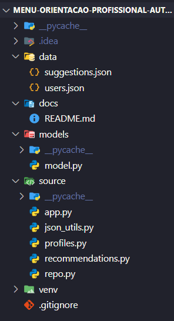

# Menu Orientação Profissional Automatizada

## Descrição do Projeto e Propósito
O Sistema de Orientação Profissional Automatizada é uma aplicação desenvolvida em Python, com o objetivo de ajudar usuários a identificar áreas de atuação profissional adequadas às suas habilidades.

O sistema simula o funcionamento de um assistente inteligente, que:

- Cadastra usuários com base em nome, profissão desejada e habilidades;
- Armazena esses dados em um banco de dados local (formato JSON);
- Analisa as habilidades informadas e gera recomendações automáticas de carreiras compatíveis.

Este projeto demonstra na prática os conceitos de:

- Programação orientada a objetos (POO);
- Manipulação de arquivos JSON;
- Estrutura modular de software;
- Persistência de dados;
- Interação simples via terminal.

O sistema pode servir como base para aplicações futuras em assistentes inteligentes, orientação de carreira automatizada ou integração com sistemas de IA.

## Instruções de Execução:
1. Clone ou baixe o repositório:
   ```
   git clone https://github.com/SEU_USUARIO/seu-projeto.git
   cd seu-projeto
   ```
2. Execute o programa principal:
   ```
   python source/app.py
   ```
3. Siga as opções do menu exibido no terminal:
   ```
   === Menu Orientação Profissional Automatizada ===
    [1] Adicionar Usuário
    [2] Listar Usuários
    [3] Gerar Recomendação
    [0] Sair
   ```
## Estrutura de Arquivos e Classes
### Arquivos:


### Classes:
1. Model: Define o modelo de dados de um usuário, com nome, profissão, habilidades, estágio e data de criação.
2. Profiles: Gerencia a criação, listagem e armazenamento de usuários.
3. Recommendation: Realiza buscas e recomendações automáticas de carreira com base nas habilidades.
4. Repo: Lê o arquivo de sugestões e retorna áreas de atuação para cada habilidade.
5. Manager: Responsável por ler e salvar dados JSON com segurança.

## Funcionamento:

[Clique aqui para assistir o funcionamento](https://youtu.be/_5ZvJkxqtAw)

## Integrantes
1. Miguel Vanucci RM: 563491
2. Igor Zuvela RM: 563602


   


